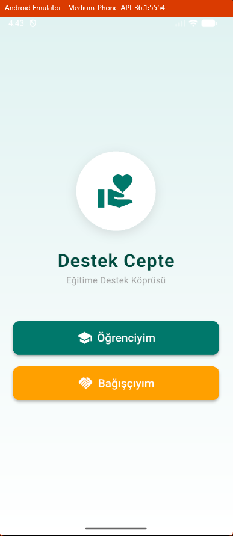
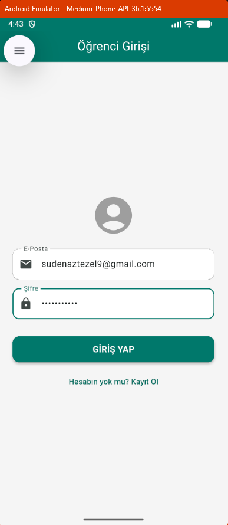
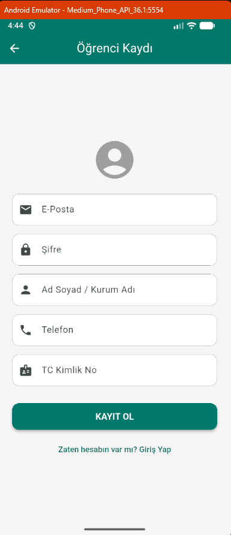
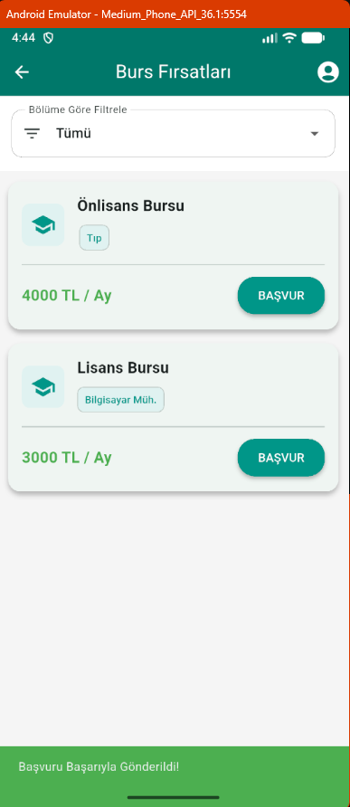
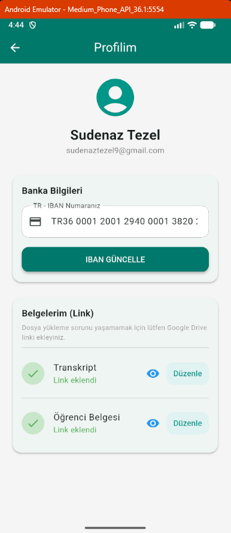
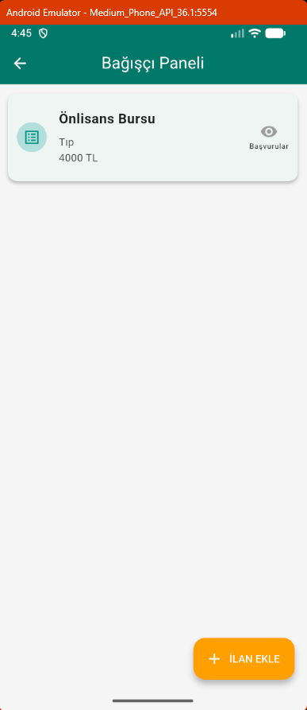

# Destek Cepte - Eğitime Destek Köprüsü 🎓

**Destek Cepte**, öğrencilerin burs imkanlarına kolayca ulaşmasını sağlayan ve bağışçıların güvenilir bir şekilde öğrencilere destek olmasını hedefleyen mobil bir Flutter uygulamasıdır.

Bu proje, Mobil Programlama dersi dönem sonu projesi olarak geliştirilmiştir.

## 📱 Özellikler

* **Rol Tabanlı Giriş:** Öğrenci veya Bağışçı olarak ayrı panellere giriş imkanı.
* **Google Drive Entegrasyonu:** Öğrenciler Transkript ve Öğrenci Belgelerini dosya boyutu sorunu yaşamadan Drive linki olarak profillerine ekleyebilirler.
* **İlan Filtreleme:** Öğrenciler bölümlerine uygun burs ilanlarını filtreleyebilir.
* **Bağışçı Paneli:** Bağışçılar yeni burs ilanı oluşturabilir ve başvuran öğrencilerin bilgilerini görüntüleyebilir.
* **Güvenli Altyapı:** Firebase Authentication ve Firestore veritabanı kullanımı.

---

## 📸 Ekran Görüntüleri

Uygulamanın çalışır durumdaki ekran görüntüleri aşağıdadır:

### 1. Giriş ve Kayıt İşlemleri
| Rol Seçimi | Öğrenci Girişi | Öğrenci Kaydı |
| :---: | :---: | :---: |
|  |  |  |

### 2. Öğrenci Paneli
Öğrenciler bursları listeler ve profillerine **Google Drive linki** üzerinden belge eklerler.

| Burs Başvuruları | Öğrenci Profili |
| :---: | :---: |
|  |  |

### 3. Bağışçı Paneli
Bağışçılar ilanlarını yönetir ve başvuran öğrencilerin detaylarını inceler.

| Bağışçı İlanları | Başvuranları Görüntüleme |
| :---: | :---: |
|  |  |

---

## 🛠️ Kurulum ve Çalıştırma

Projeyi kendi bilgisayarınızda çalıştırmak için:

1.  Repoyu klonlayın:
    ```bash
    git clone [https://github.com/sudetezel/destek-cepte.git](https://github.com/sudetezel/destek-cepte.git)
    ```
2.  Proje dizinine gidin ve paketleri yükleyin:
    ```bash
    cd destek_cepte
    flutter pub get
    ```
3.  Uygulamayı başlatın:
    ```bash
    flutter run
    ```

## 📝 Notlar
* Proje **Firebase** altyapısını kullanmaktadır.
* Veritabanı optimizasyonu için belge yükleme işlemlerinde **Drive Linki** yapısı tercih edilmiştir.

---
**Geliştirici:** Sudenaz Tezel